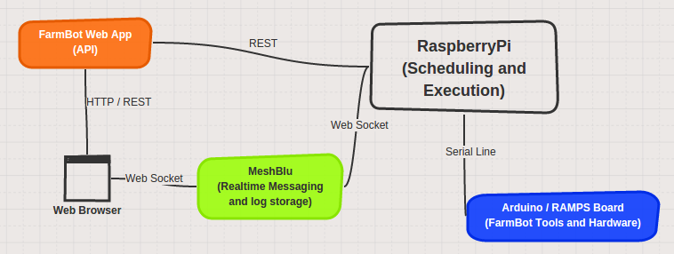

# FarmBot Software for the RaspBerry Pi

This software is responsible for receiving the commands from the 'farmbot cloud backend', execute them and report back the results.

Technical Stuff
---------------


[Thanks, SketchBoard.me](https://sketchboard.me/RzvYVFEQuREe#/)

* Written in Ruby.
* Operation scheduling data is stored in SQLite 3.
* Device status info, such as X, Y, Z and calibration data is stored via [PStore](http://ruby-doc.org/stdlib-1.9.2/libdoc/pstore/rdoc/PStore.html)
* Messaging happens via [MeshBlu](https://github.com/octoblu/meshblu) (machine instant messaging)
* Communicates with Arduino hardware using the [farmbot-serial gem](https://github.com/FarmBot/farmbot-serial)

# Running in production

```
bundle install
```

If you want to enable auto restarts on crash or memory leak, run:

```
god -c farmbot.god -D
```

If you don't care about autorestarts, just run:

```
ruby farmbot.rb
```

**You can find your device credentials inside of `credentials.yml`**

# Running on Local

If you're running your own local [farmbot web app](https://github.com/farmbot/farmbot-web-app)

`FBENV=development ruby farmbot.rb`


Installation
============

Install Ruby 2.2
----------------

This gem requires Ruby 2.2. As of this writing, a Pi is loaded with 1.9.3 by default.

To upgrade your ruby version, try this:

```
curl -L https://get.rvm.io | bash -s stable --ruby
```

This will take about 2 hours on a standard pi.

Raspberry PI
------------

Update the RPi, install ruby and the arduino IDE
```
sudo apt-get update
sudo apt-get install git-core sqlite3 arduino
```

Clone, install and run:

```
git clone https://github.com/FarmBot/farmbot-raspberry-pi-controller
cd farmbot-raspberry-pi-controller
gem install bundler
bundle install
rake db:setup
ruby farmbot.rb
```

At this point, your MeshBlu credentials can be found in `credentials.yml`

Arduino
-------

**If your device doesn't use `/dev/ttyACM0`**: Write the name of your serial device (usually /dev/ttyUSB0) in `serial_port.txt`.

You will need to flash your Arduino with custom firmware. For instructions on how to do this, see [the FarmBot-Arduino github page](https://github.com/FarmBot/farmbot-serial)

Author
------

 * Rick Carlino

 * Tim Evers

License
-------

The MIT License

Copyright (c) 2015 Farmbot Project

Permission is hereby granted, free of charge, to any person obtaining
a copy of this software and associated documentation files (the
'Software'), to deal in the Software without restriction, including
without limitation the rights to use, copy, modify, merge, publish,
distribute, sublicense, and/or sell copies of the Software, and to
permit persons to whom the Software is furnished to do so, subject to
the following conditions:

The above copyright notice and this permission notice shall be
included in all copies or substantial portions of the Software.

THE SOFTWARE IS PROVIDED 'AS IS', WITHOUT WARRANTY OF ANY KIND,
EXPRESS OR IMPLIED, INCLUDING BUT NOT LIMITED TO THE WARRANTIES OF
MERCHANTABILITY, FITNESS FOR A PARTICULAR PURPOSE AND NONINFRINGEMENT.
IN NO EVENT SHALL THE AUTHORS OR COPYRIGHT HOLDERS BE LIABLE FOR ANY
CLAIM, DAMAGES OR OTHER LIABILITY, WHETHER IN AN ACTION OF CONTRACT,
TORT OR OTHERWISE, ARISING FROM, OUT OF OR IN CONNECTION WITH THE
SOFTWARE OR THE USE OR OTHER DEALINGS IN THE SOFTWARE.

