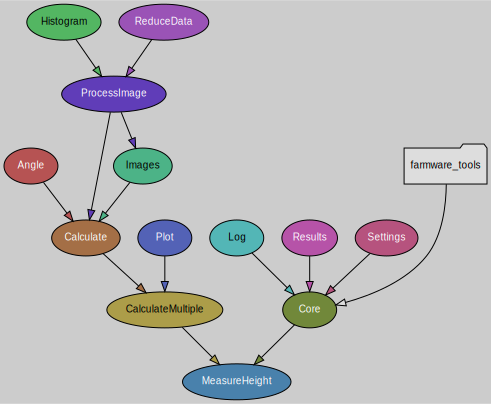

# Measure Soil Height
Farmware to measure soil height using OpenCV

# Concept

Simulate a virtual stereo camera using FarmBot's CNC camera positioning system.

Stereo photography, like binocular vision, provides depth information
via parallax, where subjects closer to the lens move further in the frame
between lens positions than subjects farther from the lens. OpenCV computes
this disparity between detected object positions in stereo image frames.

This process is performed at multiple locations to develop equation
coefficients for a correlation between disparity and distance for a particular
camera and environment. These coefficients are applied to the computed disparity
values (with the soil as the subject) to calculate distance, which is finally
combined with camera position data from FarmBot's known coordinate system
to calculate the z axis coordinate of the soil.

With the soil position mapped to FarmBot's coordinate system, FarmBot can
perform actions that engage the soil surface such as seeding and weeding.

## Alternatives
 * Manually measure the distance from the FarmBot's UTM to the soil and
 subtract it from the current z-axis position.
 * Move FarmBot to the soil surface using manual controls and record the
 z-axis position.
 * Add a button to FarmBot's UTM that triggers when it collides with the
 soil surface.
 * Use an ultrasonic, infrared, or LiDAR distance sensor.
 * Use a stereo camera.

# Usage

## Install
[Farmware panel](https://my.farm.bot/app/designer/farmware) install URL:
```
https://raw.githubusercontent.com/FarmBot-Labs/measure-soil-height/main/manifest.json
```

## Run
1. Move FarmBot to a location where the camera has a clear view of a wide area of soil.
Ensure the Y and Z axes have room to move away from home/zero.
3. Measure the distance from the camera lens to the soil with a tape measure.
4. Select **Measure Soil Height** in the [Farmware panel](https://my.farm.bot/app/designer/farmware).
5. Enter the measured distance in millimeters in the
_Measured distance from camera to soil_ input.
6. Press **CALIBRATE**. FarmBot will (see [capture images](#capture-images) for a diagram):
    * take a photo
    * move the y-axis a small amount
    * take another photo
    * move the z-axis
    * take another photo
    * move the y-axis back
    * take another photo
    * move the z-axis back
7. Check the calibration results and image output.
See [interpreting output images](#interpreting-output-images) and
[possible failures](#possible-failures).

At this point, calibration is complete. Soil height can now be measured and
recorded by pressing **MEASURE** in the **Measure Soil Height** Farmware panel
or using a **Measure Soil Height** sequence command and running the sequence
(execute the sequence over a point grid group for full garden soil mapping).

The measured soil z coordinate will be shown in a toast message and saved
to a soil height point in the _Points_ panel. An image will be saved to the
_Photos_ panel which will also be shown in the map if the camera has been
calibrated (via the `Camera calibration` section of the _Photos_ panel).

To re-calibrate, press **RESET CALIBRATION VALUES** in the
**Measure Soil Height** Farmware panel and follow the [steps to run](#run).

For output customization, see [verbosity settings](#verbosity-settings).

# Workflow

## Capture images
Move to locations a short distance apart to simulate a stereo camera.


For calibration, move to multiple z-axis locations and capture stereo pairs
at each.


## Prepare images
Adjust the captured images as necessary to create an aligned stereo image pair.


Detect camera rotation using optical flow:


For the stereo depth calculation to work correctly, features in the left input
image must trace a horizontal path to the right input image.


## Compute depth map
Combine stereo images to generate a disparity/depth map.


Histogram illustrating occurrence frequency of values in depth map:


## Determine location of soil in image
Assume the most common depth map value represents the soil.
In the following image, the selected soil depth is highlighted in green.
Depth values for objects far from the soil level are highlighted with red,
with bright red indicating objects closer to the camera and dark red
indicating objects farther from the camera.


Annotate the depth map using the same color-coding:


Exclude plants using HSV filtering with the values provided in the
`Weed detector` section of the _Photos_ panel.

Plants selected:


Plants removed from depth map to not interfere with soil surface selection:


## Calibrate disparity vs distance conversion factors


Two coefficients are necessary to calculate distance from the raw disparity
data. The following are used:
 * a disparity multiplication factor (`calibration_factor`)
 * a disparity offset constant (`disparity_offset`)

Example calculations, where:
 * Soil was measured 250mm from camera when camera was at z = 0
 * Soil disparity was calculated from a stereo image pair (`disparity_offset`)
 at z = 0
  * Soil disparity was calculated from a stereo image pair (`disparity_value`)
 at z = -50

```
disparity_delta = disparity_value - disparity_offset
64              = 176             - 112

z_offset = measured_at_z - current_z
50       = 0             - (-50)

calibration_factor = z_offset / disparity_delta
0.7812             = 50       / 64
```

See [calculate distance and soil z](#calculate-distance-and-soil-z) for z
calculations.

## Calculate distance and soil z

Example calculations, where:
 * Soil was measured 250mm from camera when camera was at z = 0
 * Calibration values were previously calculated (`calibration_factor`
 and `disparity_offset`)
 * Soil disparity was calculated from a stereo image pair (`disparity_value`)
 at z = -50

```
measured_soil_z = measured_at_z - measured_distance
-250            = 0             - 250

disparity_delta = disparity_value - disparity_offset
64              = 176             - 112

distance_offset = disparity_delta * calibration_factor
50              = 64              * 0.7812

distance = measured_distance - distance_offset
200      = 250               - 50

calculated_soil_z = current_z  - distance
-250              = -50        - 200
```

# I/O

## Inputs

* Farmware inputs. _Measured distance from camera to soil_ is the only required input.
* Current position. Retrieved via Farmware bot state API.
* Images from camera (at different locations).

## Outputs

See [verbosity settings](#verbosity-settings) for customization.

* Logs: calculated soil z, debug messages.
* Points: `Soil Height` point with calculated z coordinate of soil.
* Images: depth map, debug images.
* FarmwareEnvs: with `measure_soil_height_calibration_` prefix (calibration only)
* Data files: settings, results JSON (local development only)

# Interpreting output images

## Recognizing good data

A large portion of the annotated depth map should be green, which represents
a large area of detected soil at a consistent height.


The rotated stereo image pair should show features that are offset horizontally
to the left between the left and right frames.


The disparity histogram should show a prominent spike, which represents a
large number of similar depth values.


For examples of poorly configured captures, see [possible failures](#possible-failures).

# Possible failures

## Incorrect input orientation

When the left and right stereo pair images are swapped, or the images are not
corrected for camera rotation (so that objects are not offset orthogonally
between left and right frames), the disparity computation produces noise:


And the corresponding histogram is relatively flat with no large count of
similar depth values:


## Non-linear disparity

When the disparity calculation fails to produce linear differences between
distance values, an incorrect distance is calculated.


This may be caused by poor quality image captures or subject matter,
or by motor stalls.

## Insufficient detail

Disparity cannot be properly calculated if the algorithm cannot match objects
between stereo frames, or the disparity is the same between frames.

### Too blurry

Try moving the camera closer or choosing a higher resolution setting.

### Un-featured soil

Try choosing a different soil location, moving the camera closer, or
choosing a higher resolution setting.

### Too far

Try moving the camera closer or choosing a higher resolution setting.

## Error messages

`Problem getting image`:
Verify camera is working by taking a photo.

`Calibration measured distance input required`:
Provide a distance measurement (see [steps to run](#run)).

`Image size must match calibration`:
Recalibrate or revert change to image capture size or rotation.

`Not enough detail`:
Verify the camera is working and enough light is present.

`Couldn't find surface` or `Not enough disparity information` or `Zero disparity`:
See [incorrect input orientation](#incorrect-input-orientation)
and [insufficient detail](#insufficient-detail).

`Soil height calculation error` or `Zero disparity difference` or `Zero offset`:
Verify z-axis motor is working or try recalibrating at a different location.

# Verbosity settings

Some outputs can be customized via inputs.
For an overview of all outputs, see [outputs](#outputs).

## Logs

Log verbosity is adjustable via the `Log verbosity` input value.

| log type | output               |  0  |  1  |  2  |  3  |
|:---------|:---------------------|:---:|:---:|:---:|:---:|
| success  | result toast message |     |  x  |  x  |  x  |
| debug    | basic operation logs |     |     |  x  |  x  |
| debug    | low-level debug logs |     |     |     |  x  |

## Images

Output image verbosity is adjustable via the `Image output option` input value.

| description         |  0  |  1  |  2  |  3  |  4  |  5  |  6  |  7  |
|:--------------------|:---:|:---:|:---:|:---:|:---:|:---:|:---:|:---:|
| color map w/ img    |     |     |  x  |     |     |     |  x  |  x  |
| b/w depth map       |     |     |     |  x  |     |     |  x  |  x  |
| stereo images       |     |     |     |     |  x  |     |  x  |  x  |
| collage             |     |     |     |     |     |  x  |  x  |  x  |
| color depth map     |     |     |     |     |     |     |  x  |  x  |
| depth histogram     |     |     |     |     |     |     |  x  |  x  |
| image histogram     |     |     |     |     |     |     |  x  |  x  |
| raw depth histogram |     |     |     |     |     |     |  x  |  x  |
| plant selection     |     |     |     |     |     |     |     |  x  |
| grayscale inputs    |     |     |     |     |     |     |     |  x  |
| rotated inputs      |     |     |     |     |     |     |     |  x  |
| rotated depth map   |     |     |     |     |     |     |     |  x  |
| rotation values     |     |     |     |     |     |     |     |  x  |
| calibration plot*   |     |     |  x  |  x  |  x  |  x  |  x  |  x  |

\* Only available during calibration.

# Organizational overview

## Scripts
__MeasureHeight__ - Move bot to photo locations, capture images, and run calculations.
If calibration values are not present, capture images at two different z-axis
positions to complete calibration. Otherwise, calculate and record the soil
z coordinate at the current location.

__test__ - _(for development only)_ Calculate soil height in the provided test images.

## Modules
 - __CalculateMultiple__ - Calculate soil height for any number of stereo image pairs.
Generate and save summary data and plot of the calculations at each stereo height.
   - __Plot__ - Simple plot generation. Used for disparity vs distance graph.
   - __Calculate__ - Calculate soil height or calibration values from a stereo image pair.
     - __Angle__ - Input image rotation detection.
     - __Images__ - Manage input and output images.
   - __ProcessImage__ - Individual image handling and processing.
     - __ReduceData__ - Data reduction and analysis. Find the most common depth in an image.
     - __Histogram__ - Generate image and text histograms from the provided data.
 - __Core__ - Wraps Settings, Log, Results, and FarmwareTools for ease of use.
   - __Settings__ - Import and manage inputs provided via environment variables.
(includes `Farmware` page inputs, `Run Farmware` step inputs, and other `FarmwareEnvs`.)
   - __Log__ - Send log messages, toasts, and errors.
   - __Results__ - Summarize and handle all output. Saves files and uploads results.
   - __SerialDevice__ - _(for local development only)_ Communicate with a device running the
[FarmBot Arduino Firmware](https://github.com/FarmBot/farmbot-arduino-firmware)
over a serial connection. Can be used instead of `farmware_tools.device`
for local development purposes.


